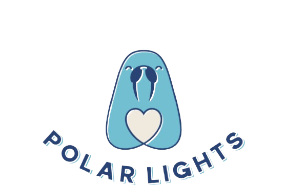

# Landing Page with Bootstrap

This is a responsive travel-themed landing page built using **HTML**, **CSS**, and **Bootstrap**. Below is a detailed breakdown of how **Bootstrap** was integrated into the project.

---

## Bootstrap Integration Overview

Bootstrap was included using a **CDN** link in the `<head>` section of `index.html`:

```html
<!-- Bootstrap CSS -->
<link
  href="https://stackpath.bootstrapcdn.com/bootstrap/5.3.2/css/bootstrap.min.css"
  rel="stylesheet"
/>
```

Including Bootstrap via CDN allows quick and easy access to its grid system, components, and utility classes. This setup makes the site more responsive and consistent across different screen sizes. Using a CDN also improves loading speed by allowing browsers to cache the Bootstrap files.

## 1. Header Section

I used Bootstrap's container class to center the content within the header section. The bg-dark class was applied to give the header a dark background, improving contrast and readability. The py-3 class was added to provide consistent vertical padding, ensuring a clean and balanced look.

### Bootstrap components and classes used:

- container – Centers the header content.
- bg-dark – Applies a dark background.
- py-3 – Adds vertical padding.

```html
<header class="logo bg-dark py-3">
  <div class="container">
    
  </div>
</header>
```


## 2. Form Section

I implemented the form using Bootstrap's form-control class for consistent input styling. The container, row, and col-md-6 classes were used to center the form and make it responsive. The btn class was applied to the submit button, ensuring consistent design with other buttons on the page.

### Bootstrap form components and grid system used:

- container – Centers content.
- row and col-md-6 – Ensures responsive layout.
- form-control – Applies Bootstrap styling to inputs.

```html
<section class="form" id="form">
  <div class="container">
    <div class="row justify-content-center align-items-center">
      <div class="col-12 col-md-8 col-lg-6">
        <form class="form-container">
          <div class="form-group">
            ...
          <div class="form-group">
            <button type="submit" class="submit-btn">Submit</button>
          </div>
        </form>
      </div>
    </div>
  </div>
</section>
```


## 3. Client Feedback Section

I used Bootstrap's row and col-md-4 classes to create a flexible grid layout for the client feedback cards. The container class was used to keep the content centered and aligned. The card component was customized with additional CSS for hover effects and improved appearance.

### Bootstrap grid system and card components used:

- container – Centers content.
- row and col-md-4 – Sets up responsive grid for testimonials.
- card – Bootstrap card component styling.

```html
<section class="client-feedback py-5">
  <div class="container">
    <h2 class="text-center mb-5">What our clients say</h2>
    <div class="row">
      <div class="col-md-4">
        <div class="feedback-card">
          <p class="feedback-text">"Amazing experience!"</p>
          <span class="feedback-author">- Emily R.</span>
        </div>
      </div>
    </div>
  </div>
</section>
```


## 4. Footer Section

I used Bootstrap's container, row, and col-md-4 classes to structure the footer into a responsive layout. The d-flex utility class was used for alignment and spacing. I also applied the bg-dark and text-light classes to create contrast and improve readability.

### Bootstrap utility classes and grid system used:

- container – Centers content.
- row and col-md-4 – Creates a responsive footer grid.
- d-flex – Flexbox utility for alignment.

```html
<div class="footer_contact_wrap bg-dark text-light py-5">
  <div class="container">
    <div class="row align-items-center">
      <div class="col-md-4 text-center mb-4">
        
      </div>
      <div class="col-md-8 d-flex flex-wrap justify-content-center gap-4">
        ...
      </div>
    </div>
  </div>
</div>
```


## Conclusion

In this project, I successfully integrated Bootstrap to create a modern and responsive travel-themed landing page. I used Bootstrap's components, and utilities to structure and style the header, slider, offers section, form, feedback, and footer. I also added custom CSS to enhance the design and give it a unique look. As a result, I created a visually appealing and user-friendly website that looks great on all devices.
