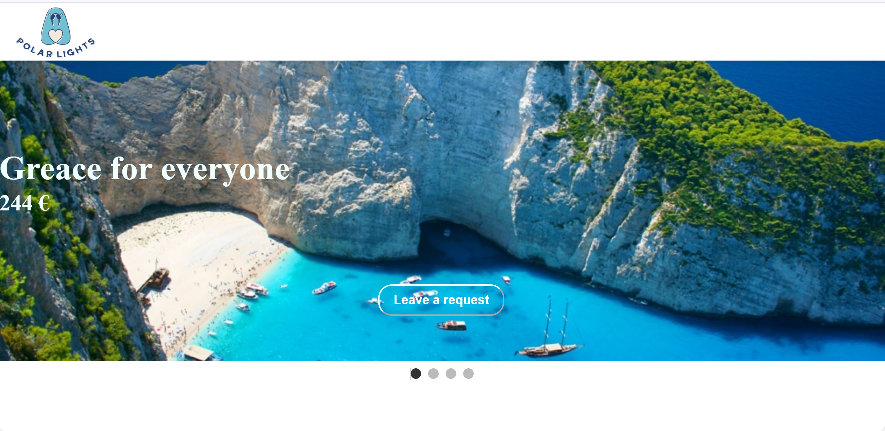

# Tour Agency Landing Page

## Overview

This is a landing page for a travel agency, offering various travel packages and exclusive deals. The webpage includes a header, a hero section with a slideshow, a section for hot travel offers, a contact form, and a footer with contact details.

## Sections

### 1. Header

- Contains the company logo for branding.
- Ensures easy recognition of the agency.

### 2. Hero Section

- Displays a slideshow of featured travel destinations.
- Each slide includes an image, destination name, price, and a button to submit a request.
- Navigation buttons allow users to switch between slides.

**Button LEAVE A REQUEST leads to form section**

### 3. Hot Offers Section

- Highlights exclusive travel deals.
- Each offer displays an image, destination name, and price.
- Structured in a responsive grid layout.

### 4. Contact Form

- Allows users to enter their name and phone number to request more information.
- Includes basic validation to ensure correct input format.
- Submit button for sending inquiries.

### 5. Footer

- Displays the company logo for branding.
- Lists contact information including phone number, email, and physical address.
- Ensures visitors can easily reach the company.

## Technologies Used

- HTML5 for structure.
- CSS for styling and responsive design.

## Features

- User-friendly design with clear call-to-action buttons.
- Smooth and responsive slideshow for destination highlights.
- Hot offers section dynamically showcases the best travel deals.
- Easy-to-use contact form for customer inquiries.
- Well-organized footer with essential contact information.

## How to Use

1. Open the landing page in a web browser.
2. Navigate through the hero slideshow to explore travel destinations.
3. Check out the latest hot offers.
4. Fill out the contact form for inquiries.
5. Use the footer section for direct communication with the agency.

This landing page is designed to attract customers and provide an easy way to explore and book travel packages.
